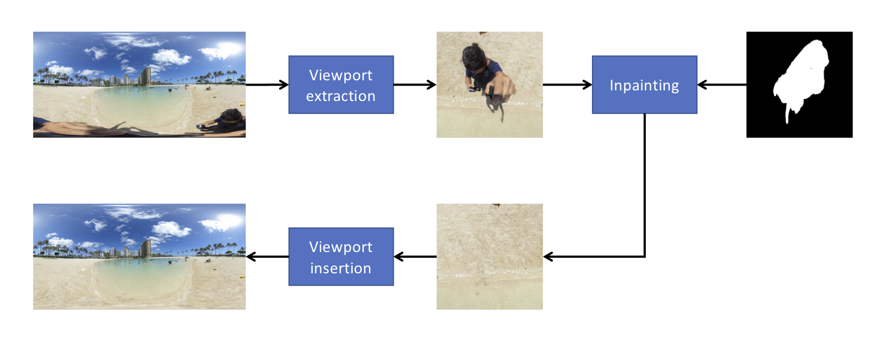
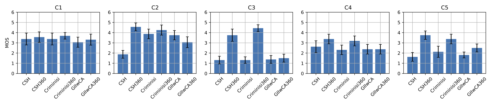

# Inpainting360
Applying inpainting to omnidirectional images

Viewport extraction method for object removal using inpainting

### Results of subjective quality evaluation

Mean opinion scores with 95% confidence intervals

### Third-party software used

| Abbreviation | Base algorithm name                                 | Viewport | Source code                                                                        |
| :----------- | :-------------------------------------------------- | :------- | :--------------------------------------------------------------------------------- |
| CSH          | Coherency sensitive hashing                         | No       | http://github.com/PetterS/patch-inpainting \[Commit: 03cc575\]        |
| CSH360       | Coherency sensitive hashing                         | Yes      | \- -                                                                               |
| Criminisi    | Exemplar-Based Image Inpainting                     | No       | http://github.com/cheind/inpaint \[Commit: 864128c\]                  |
| Criminisi360 | Exemplar-Based Image Inpainting                     | Yes      | \- -                                                                               |
| GIIwCA       | Generative Image Inpainting w/ Contextual Attention | No       | http://github.com/JiahuiYu/generative_inpainting \[Commit: 6bfaa20\] |
| GIIwCA360    | Generative Image Inpainting w/ Contextual Attention | Yes      | \- -                                                                               |
